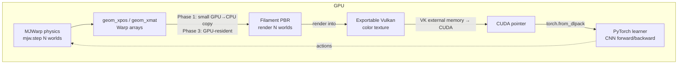

# mujofil-warp — Feasibility & Architecture

**Goal:** render MJWarp's GPU-resident parallel MuJoCo worlds with Google
Filament's physically-based renderer (PBR + IBL + soft shadows), keeping data on
the GPU to avoid the CPU round-trip that caps throughput.

This is "Option B" from the project discussion: rather than compete with MJWarp
on speed (we can't — its physics is GPU-resident) or with NVIDIA on a ray tracer,
we **fill the fidelity gap MJWarp explicitly left open.**

---

## 1. Where each system keeps its data (the crux)

| Stage | MJWarp | CPU-mujofil (existing) | mujofil-warp (target) |
|---|---|---|---|
| Physics state | **GPU** (Warp arrays) | CPU (`mjData`) | **GPU** (Warp arrays) |
| Geom transforms (`geom_xpos/xmat`) | GPU | CPU | GPU → renderer |
| Rasterization | GPU (raycaster) | GPU (Filament) | GPU (Filament PBR) |
| Pixels out | GPU (Warp array) | GPU→**CPU** readback | GPU (shared texture) |
| Learner (PyTorch) | GPU | CPU→GPU re-upload | GPU (zero-copy) |

The existing CPU `mujofil` pays **3 CPU↔GPU crossings per step** (upload
transforms, read back pixels, re-upload pixels). MJWarp pays **0**. The entire
point of mujofil-warp is to get as close to 0 as possible while substituting
Filament's PBR for MJWarp's flat shading.

### Cost asymmetry — what actually has to stay on the GPU

Two data flows cross the boundary; they are wildly different in size:

- **Transforms IN:** `ngeom × 12 floats` per world. Tiny (KBs). A GPU→CPU copy
  here is *cheap* and acceptable for a first version.
- **Pixels OUT:** `nworld × H × W × 4 bytes`. Large (MBs/frame) and on the hot
  path. This is the crossing that **must** be eliminated. Readback + re-upload of
  pixels is the expensive round-trip.

**Conclusion:** prioritize zero-copy *pixel output* (Filament→CUDA/PyTorch).
Defer zero-copy *transform input* — copy it on the CPU at first, optimize later.

---

## 2. Verified primitives (smoke-tested on this machine)

Confirmed available on RTX 4060 Laptop / Ubuntu 22.04 / CUDA 12.4 driver:

- **MJWarp runs**: `mujoco-warp 3.9.0.1`, `warp-lang 1.14.0`, sees `cuda:0`
  (sm_89, 8 GiB). Physics ~64k env-steps/s (16 worlds, simple scene, CUDA-graph).
- **MJWarp render is low-fi** (confirmed visually, `out/mjwarp_world0.png`):
  single-hit Lambertian, radial light falloff, no PBR/IBL/GI. Docs confirm:
  *"single hit raycaster optimized for high throughput and low fidelity … does
  not support global illumination … physically based material properties."*
- **Warp arrays are GPU-resident and interop-capable**: Warp documents zero-copy
  interop with both JAX and PyTorch (dlpack). MJWarp `Data` fields are
  `wp.array`s on device.
- **PyTorch dlpack present**: `torch.from_dlpack` available, torch CUDA 12.4.
- **Filament can import an external native texture**:
  `Texture::Builder::import(intptr_t id)` — *"Specify a native texture to import
  as a Filament texture."* (filament `include/filament/Texture.h:262`). This is
  the hook for rendering into / sharing a GPU texture.
- **Filament exposes a Vulkan platform layer**:
  `include/backend/platforms/VulkanPlatform.h` exists in the prebuilt deps.

### The one unverified, make-or-break risk

`Texture::import()` is documented with **Metal and OpenGL** native-texture
examples. **Vulkan external-memory sharing with CUDA** (the path we need:
`VK_KHR_external_memory` → CUDA `cudaExternalMemory` → torch tensor) is **not
confirmed** for the *prebuilt* Filament binary. The prebuilt Vulkan backend
likely creates its own `VkDevice`/queues without exporting memory handles.

**Therefore the likely requirement: build Filament from source** with a custom
`VulkanPlatform` that (a) creates images with `VK_EXTERNAL_MEMORY_HANDLE_TYPE_*`
and (b) exposes the FD/handle so CUDA can import it. This is the central
engineering risk and must be de-risked early (Phase 2 spike).

---

## 3. Phased plan (correctness first, then zero-copy)

### Phase 0 — Baseline ✅ (done)
- `scripts/smoke_mjwarp.py`: MJWarp GPU physics + its raycaster; saved sample
  renders; measured throughput; confirmed low fidelity. Establishes what we must
  beat on quality.

### Phase 1 — Naive correctness bridge (no zero-copy yet)
Prove PBR images can be produced from MJWarp state, ignoring performance.
1. Step physics in MJWarp (`mjw.step`) for N worlds on GPU.
2. Copy `geom_xpos`, `geom_xmat`, `cam_xpos`, `cam_xmat` GPU→CPU (small).
3. Feed them into the **existing** CPU `mujofil` Filament renderer
   (`SceneBridge` already consumes these arrays), render PBR, read back.
4. Validate: PBR image of the same scene MJWarp rendered flat — visual A/B.
- **Deliverable:** side-by-side `mjwarp_flat.png` vs `mujofil_pbr.png`.
- **Value:** confirms the data mapping (MJWarp geom layout → Filament) is correct
  and quantifies the naive round-trip cost as a baseline to improve on.
- **Risk:** low. Reuses shipped code. Mismatch in geom ordering/units is the only
  gotcha.

### Phase 2 — Zero-copy pixel OUTPUT (the critical spike)
Eliminate readback + re-upload of pixels.
1. Build Filament from source (Vulkan) with a custom `VulkanPlatform` that
   allocates the render-target color attachment as **exportable external memory**.
2. Export the Vulkan image memory (opaque FD on Linux) and import into CUDA via
   `cudaImportExternalMemory` / `cudaExternalMemoryGetMappedBuffer`.
3. Wrap the CUDA pointer as a PyTorch tensor (dlpack / `torch.as_tensor` on the
   device pointer). Learner reads pixels **without leaving the GPU**.
- **Deliverable:** a torch CUDA tensor whose contents are Filament's render, with
  **no `glReadPixels`/memcpy** on the hot path.
- **Risk:** HIGH — this validates the whole thesis. If the prebuilt or
  from-source Filament cannot export Vulkan memory compatibly with CUDA on this
  driver, Option B's zero-copy premise fails and we fall back to "PBR offline
  renderer for MJWarp" (still useful, but not throughput-competitive).
- **Mitigation:** spike this in isolation FIRST (a minimal Vulkan image →
  CUDA → torch demo) before wiring any MuJoCo/Filament scene logic.

### Phase 3 — Efficient transform INPUT
Reduce/parallelize the transform path now that pixels are zero-copy.
- Option 3a: keep the small GPU→CPU transform copy (probably fine).
- Option 3b: a Warp kernel writes transforms into a mapped buffer Filament reads,
  avoiding the host hop. Only do this if profiling shows it matters.

### Phase 4 — Batched / per-world draw path
- One Filament scene with per-world instance transforms, or N lightweight views,
  to render all worlds with minimal submit overhead (mirrors the CPU
  `render_batch_rgb` idea but GPU-resident).
- Domain randomization hooks (per-world materials/lighting) to match MJWarp's DR.

---

## 4. Architecture sketch

The only host hop we tolerate long-term is the tiny transform copy (Phase 1/3);
the heavy pixel buffer never leaves VRAM (Phase 2).

---

## 5. Honest assessment

- **Upside:** a genuinely novel, defensible niche — *MJWarp's GPU speed with
  photoreal PBR*, which neither MJWarp (low-fi by design) nor CPU-mujofil
  (CPU-bound) offers. Strong for sim-to-real and synthetic data.
- **Make-or-break:** Phase 2 (Vulkan↔CUDA external memory). This is Madrona-class
  GPU-interop engineering — smaller in scope (we reuse Filament + MJWarp) but the
  interop layer is the hard, risky part. **De-risk it before investing in scene
  features.**
- **Fallback if Phase 2 fails:** ship Phase 1 as a *photoreal offline renderer
  for MJWarp* (render datasets/eval episodes in PBR, accept the round-trip). Less
  ambitious, still useful, still differentiated on fidelity.

## 6. Immediate next step

Spike Phase 2 in isolation: a ~100-line program that creates one Vulkan image
with exportable memory, imports it into CUDA, writes from a Warp kernel, and
reads it as a torch tensor — **no Filament, no MuJoCo.** If that works on this
driver, Option B is viable and we proceed to Phase 1 mapping + Phase 2
integration. If it can't, we re-plan toward the offline-renderer fallback.
